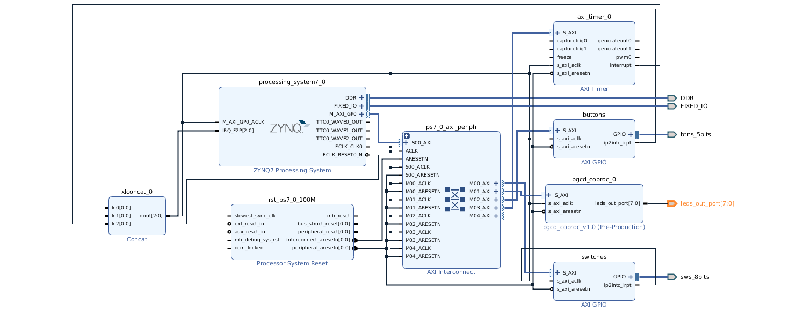

# Student Project for building a GCD coprocessor

This project has been done on a Xilinx Zedboard

The goal of this project is to build a GCD coprocessor and use it with the Zynq, without an OS and then with an embedded Linux OS through Loadable Kernel Modules.

