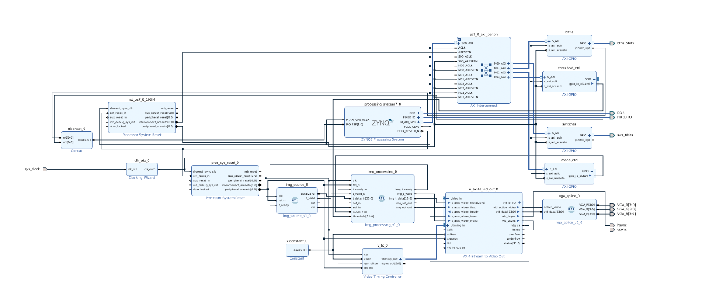

# Student project for image processing

This project was done on a Xilinx Zedboard.

The goal of this project is to display an image of coins on a screen using VGA, from an FPGA.

Some filters can be applied such as :
* A blur filter
* A grey filter
* A sobel filter

We can choose which filter can be used through the switch on the FPGA, we can also choose which threshold is used with the buttons. The code to control this, is the 'controller.c' code that runs on the Zynq.

